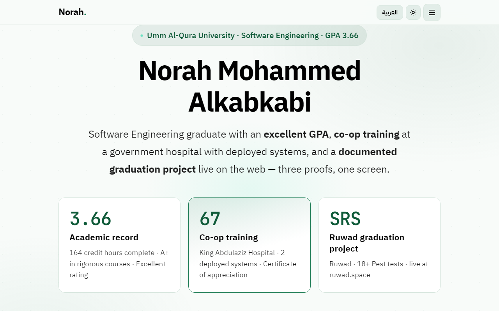
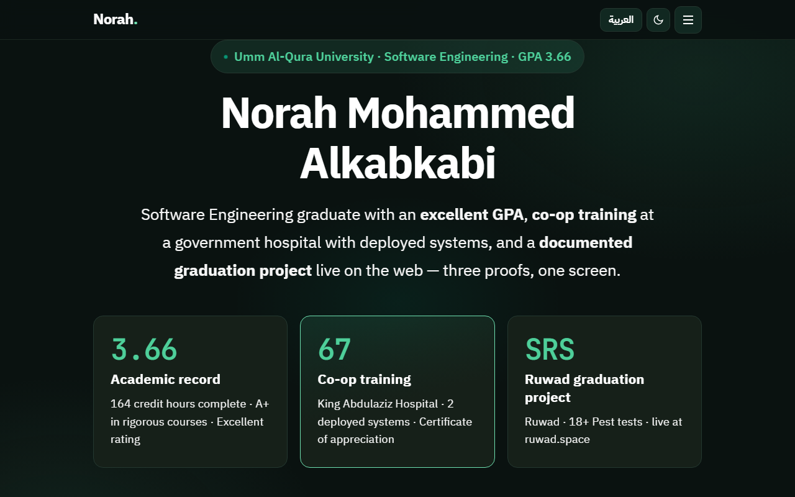
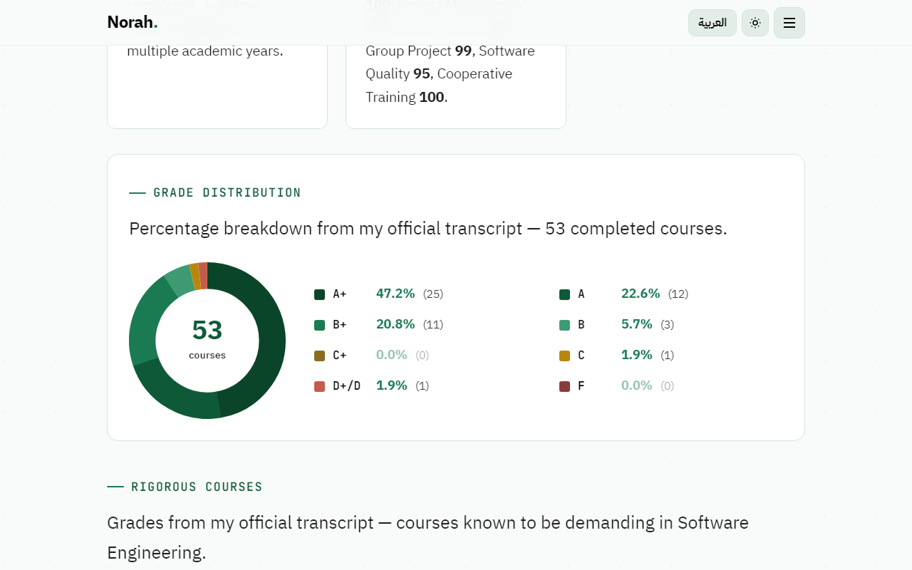
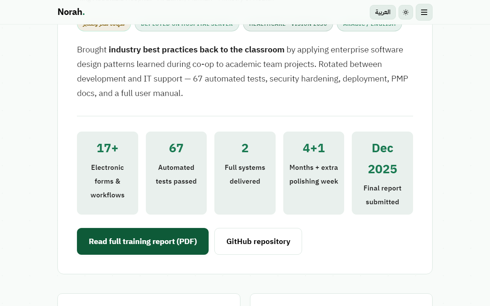
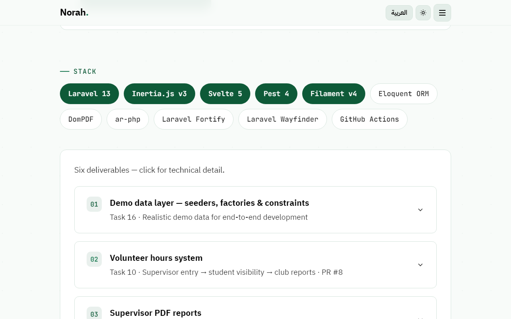

<div align="center">

# Norah<span style="color:#0e5a38">.</span> — Software Engineering Portfolio

### 🌿 *Three proofs, one screen.*

**Software Engineering graduate** with an excellent GPA, co-op training at a government hospital with deployed systems, and a documented graduation project live on the web.

<br>

[](https://alkabkabi1.github.io/portfolio/)
[](https://ruwad.space)
[](https://alkabkabi1.github.io/portfolio/#academics)
[](https://alkabkabi1.github.io/portfolio/)

<br>

🟢 **UQU forest** `#0e5a38` · 💚 **Campus green** `#1a7a52` · ✨ **Electric mint** `#00d9a0` · 🌙 **Dark forest** `#0a1210`

</div>

---

## ✨ At a glance

> *Read, not skimmed.* — academics, training, capstone contributions, and downloadable CVs in one scroll.

| | 🎓 **Academics** | 🏥 **Co-op** | 🚀 **Ruwad** |
|:---:|:---|:---|:---|
| **Headline** | GPA **3.66** / 4.00 | King Abdulaziz Hospital | Student clubs platform |
| **Proof** | 164 credits · A+ in rigorous courses | 2 systems deployed on hospital server | 18+ Pest tests · live on `main` |
| **Vibe** | *Percentage breakdown from my official transcript* | *Industry best practices back to the classroom* | *Built to be graded and taught* |

---

## 🖼️ Screenshots · English

### 🌿 Hero — light & dark

*Catchphrase: **three proofs, one screen***

<p align="center">
  
  
</p>

<p align="center"><sub>🟢 UQU green pillars · 🌙 theme toggle · 🌍 العربية / English switch</sub></p>

---

### 📊 Academic record

*Catchphrase: **everything else — in order***

<p align="center">
  
</p>

<p align="center"><sub>🎓 53 courses · donut chart · rigorous-course highlights · transcript PDF</sub></p>

---

### 🏥 Co-op training

*Catchphrase: **67 automated tests · 2 full systems delivered***

<p align="center">
  
</p>

<p align="center"><sub>🏥 Healthcare IT · ✅ deployed on hospital server · 📄 full training report PDF</sub></p>

---

### 🧪 Ruwad — graduation project

*Catchphrase: **SRS traceability · every requirement has a test***

<p align="center">
  
</p>

<p align="center"><sub>✨ Laravel 13 + Svelte 5 + Pest 4 · 📜 expandable contribution cards · 🔗 live at ruwad.space</sub></p>

---

## 💚 What’s inside

| Feature | Detail |
|:---|:---|
| 🌍 **Bilingual** | Arabic-first RTL + English toggle (`i18n.js`) |
| 🌙 **Themes** | Light UQU green & dark forest — saved in `localStorage` |
| 🎓 **Academics** | GPA breakdown, grade donut, 18 course-project PDFs |
| 🏥 **Co-op** | Hospital systems, weekly milestones, metrics & report |
| 🧪 **Ruwad** | Stack badges, SRS contributions, Pest test summary |
| 📄 **CV exports** | `cv/resume.html`, `cv/resume.tex`, cover letters |

No build step. No framework. **HTML + CSS + vanilla JS** — fast on GitHub Pages.

---

## 🗣️ Catchphrases from the site

- 🟢 *Three proofs, one screen.*
- 📖 *Details below — scroll to read.*
- 📋 *Everything else — in order.*
- 🧪 *Automated testing · technical documentation · explaining concepts to peers*
- 🏥 *Brought industry best practices back to the classroom.*
- ✨ *A meticulously documented graduation project — built to be graded and taught.*

---

## 🛠️ Tech

`HTML5` · `CSS3` custom properties · `JavaScript` · `IBM Plex Sans Arabic` · `Plus Jakarta Sans` · `JetBrains Mono`

Deployed via **GitHub Pages** from `main`.

---

## 🚀 Run locally

```bash
git clone https://github.com/Alkabkabi1/portfolio.git
cd portfolio
```

Open `index.html`, or:

```bash
python -m http.server 8080
# → http://localhost:8080
```

Switch to **English** with the locale button, or preset in DevTools:

```js
localStorage.setItem('portfolio-locale', 'en');
location.reload();
```

---

## 📁 Structure

```
portfolio/
├── index.html          # Main site
├── styles.css          # UQU green + dark forest theme
├── script.js           # Nav, theme, accordions
├── i18n.js             # AR / EN strings
├── assets/readme/      # README screenshots
├── assets/             # Transcript, certificates, course PDFs
└── cv/                 # Resume & cover letter
```

---

## 🔗 Elsewhere

| | Link |
|:---|:---|
| 🌐 | [Live portfolio](https://alkabkabi1.github.io/portfolio/) |
| 👩‍💻 | [GitHub profile](https://github.com/Alkabkabi1) |
| ✨ | [Ruwad — ruwad.space](https://ruwad.space) |
| 🏥 | [Hospital co-op repo](https://github.com/Alkabkabi1/hosipital-mangment-intermidate) |

---

<div align="center">

**© 2026 Norah Mohammed Alkabkabi**

*Software Engineering · Umm Al-Qura University · Co-op: King Abdulaziz Hospital · Graduation: Ruwad*

🟢 💚 ✨

</div>
